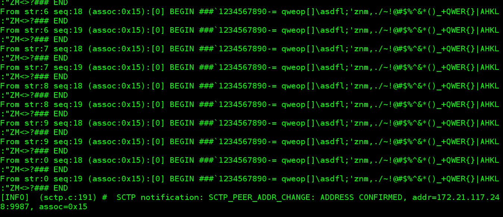
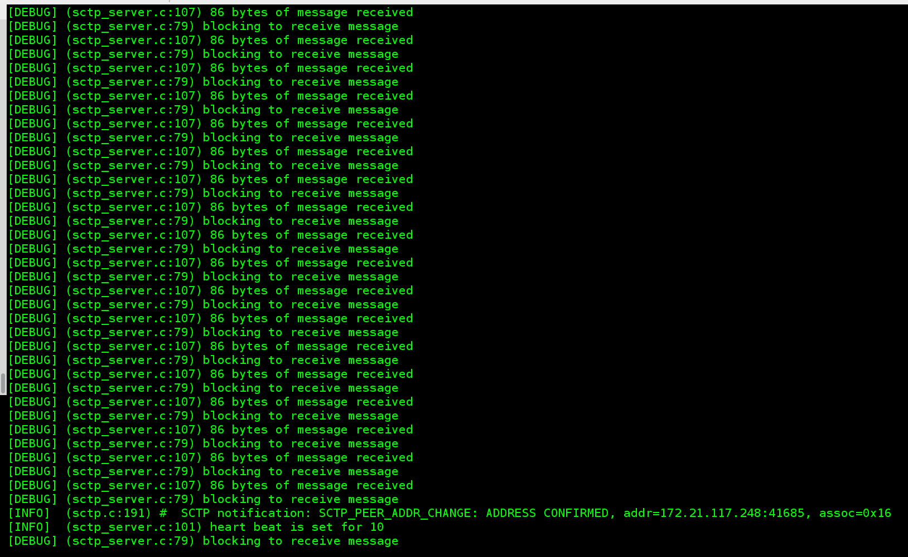

# Practice SCPT

## Pre-requisite

#### First we need sctp

* Fedora
``sudo yum install lksctp\*``

* Debian/Ubuntu
``sudo apt-get install libsctp-dev lksctp-tools``

#### Second we need libsnp

``git clone https://github.com/schwannden/libsnp``

``cd libsnp``

``make``

``sudo make install``

For those system whose ``LD_LIBRARY_PATH does not contain /usr/local/lib
and libsctp or libsnp is installed in /usr/local/lib

``source environment-setup``

#### Compile
``make``

There are currently 6 logging levels, that can be set during compilation

``LOG_LEVEL=n make``

where n could be
* 0: no logging
* 1: only error messgaes
* 2: warning messages and above
* 3: infomative messages and above
* 4: debug messages and above
* 5: all messages, same as above

For example, the default is

``LOG_LEVEL=3 make``

Which will generate all informative, error, and warning messages.

#### Running Server
Bing server to all local addresses

``./server``

Bind server to address set

``./server addr1 addr2 ... addrn``

#### Running Client
Sending messahe to specified stream

``./client server_address``

Sending message to all streams

``./client server_address all``

#### Testing
A testing mesage file called ``msg`` conntaining message begin with ``BEGIN ###`` and end with ``### END`` can be used as follows

First start the server

Test client by

What ``./client server_address all`` does is it sends the message to all streams **twice**.

On the client side, you should see

Notice if the client and server are far away, the stream numbers might not be in-order. But the sequence number in each stream should be in strict order. The SCTP_PEER_ADDR_CHANGE notification should only be shown once, as the face receives message, sctp protocol confirms the validity of the face.

On the server side, you should see

server sends out a heartbeat for no reason. I inserted the code just so you know how to use heartbeat.

Shut down client by ctrl+\, and on the server side, you should see

